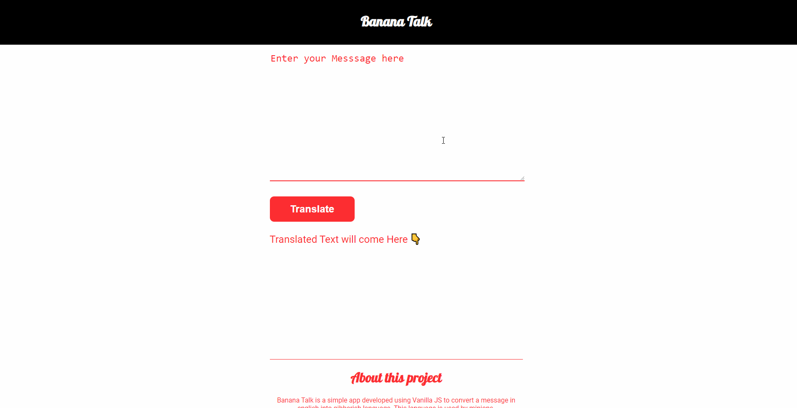

<h1 align="center" id="top">Welcome to Banana Talk 👋</h1>

# Basic Overview

> This project is a simple responsive website to convert simple english language to [Gibberish Language](https://en.wikipedia.org/wiki/Gibberish) developed to practice javaScript.

 

# Table of Contents

- [Description](#description)
- [Technologies Used](#technologies)
- [How to use](#How-to-use)
- [References](#references)
- [License](#license)
- [Related Projects](#related-projects)
- [Support](#support)
- [Author Info](#author-info)

 

# Description

A simple and easy to use responsive website created using HTML5, CSS, javascript and [fun translation API](https://funtranslations.com/) to change your message in simple english language to  [gibberish language](https://en.wikipedia.org/wiki/Gibberish). Gibberish, also called jibber-jabber or gobbledygook, is speech that is (or appears to be) nonsense. This language is used by minions.

[Live Demo](https://codersaty.github.io/bananatalk/)

 

# Technologies

- [HTML5](https://en.wikipedia.org/wiki/HTML5)
- [CSS3](https://en.wikipedia.org/wiki/CSS)
- [JavaScript](https://en.wikipedia.org/wiki/JavaScript)
- [Git](https://en.wikipedia.org/wiki/Git)
- [Markdown](https://en.wikipedia.org/wiki/Markdown)

### Tools used

- [VS Code](https://en.wikipedia.org/wiki/Visual_Studio_Code)
- [Github](https://en.wikipedia.org/wiki/GitHub)

 

# How to Use

- Write your message in place of "Enter Your Message Here" in english language.

- Hit the translate button

- The message in Gibberish language will appear below the translate button.

# References

I have used the following resources in creation of this project:

- [JavaScript in the browser!](https://www.youtube.com/watch?v=yLZazznWoAs&list=PLzvhQUIpvvuj5KPnyPyWsvgyzNkX_ACPA&index=6)

- [Minion Speak translator API](https://funtranslations.com/minion)

 

# License

[MIT License](LICENSE.md)

Copyright (c) 2021 @[codersaty](http://codersaty.me)

 

# Related Projects

- Level Zero Portfolio [Live Demo](https://codersaty.netlify.app/) [Github](https://github.com/CoderSaty/LevelZeroPortfolio)

 

# Support

In case of any problem/ query, feel free to do pull requests or contact the author.

 

# Author Info

- Twitter - [@codersaty](https://twitter.com/codersaty)
- Website - [Anuranjan Srivastava](http://codersaty.me)
- Linkedin - [codersaty](https://www.linkedin.com/in/codersaty)

 

[Back To The Top](#top)
